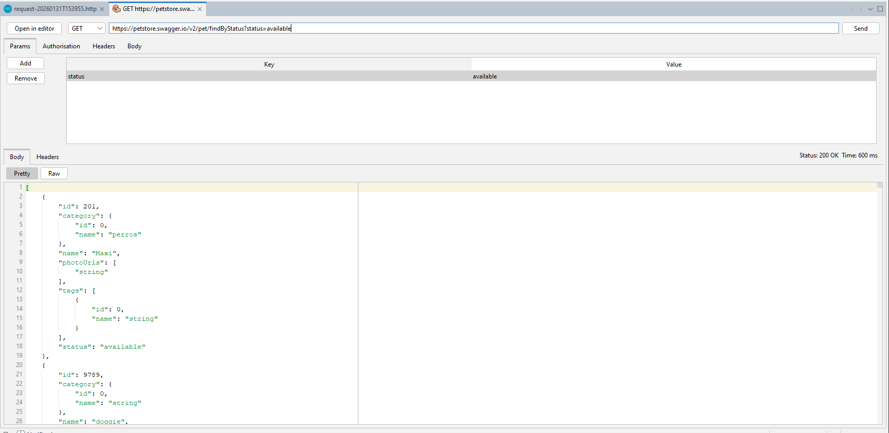
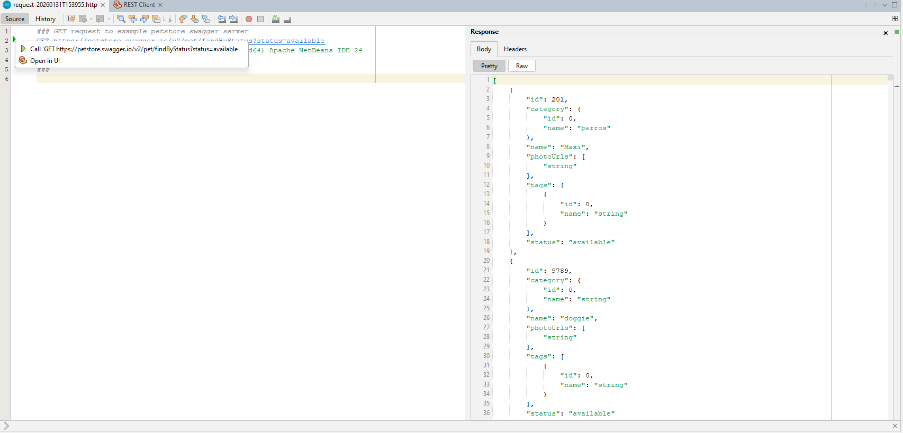

# NetBeans REST Client

<p align="center">
  
</p>

<p align="center">
  <strong>A lightweight REST client built right into Apache NetBeans — no extra apps, no subscriptions.</strong>
</p>

---

## Why?

Postman went cloud-first. Bruno requires a separate app. Sometimes you just want to test an API without leaving your IDE.

NetBeans REST Client gives you two ways to work:

- **UI Mode** — A visual interface with tabs for headers, auth, body, and params like in postman or bruno
- **Editor Mode** — Write `.http` / `.rest` files with syntax highlighting, code completion, and inline execution like the rest clients in VS Code or IntelliJ

## Features

- **All HTTP methods** — GET, POST, PUT, PATCH, DELETE, HEAD, OPTIONS (Custom TBD)
- **Authentication** — Basic Auth, Bearer Token
- **`.http` file support** — Syntax highlighting, code completion, run button in the sidebar, navigator panel
- **Postman import/export** — Migrate your collections (v2.1 format)
- **Response viewer** — Pretty-printed JSON/XML/HTML with syntax highlighting, headers, status codes, response times
- **Clickable URLs** — URLs in responses open as new requests
- **Session persistence** — Your tabs survive IDE restarts

## Installation

**Plugin Portal:**
Tools → Plugins → Available Plugins → search "REST Client" → Install

**Manual:**
Download the `.nbm` from [Releases](https://github.com/javierllorente/netbeans-rest-client/releases), then Tools → Plugins → Downloaded → Add Plugins.

## Quick Start

```http
### Get all users
GET https://api.example.com/users

### Create a user
POST https://api.example.com/users
Content-Type: application/json

{
  "name": "John Doe",
  "email": "john@example.com"
}
```

Open via **Tools → REST Client → Open in Editor**, or create any `.http` file. Click the play button next to a request to run it.

## Screenshots

<!-- TODO: Add screenshots -->
UI Mode



HTTP Editor



## Requirements

- Apache NetBeans 17+
- Java 11+

## Contributing

Contributions are welcome. Fork, branch, PR.

## License

Apache License 2.0 — see [LICENSE](LICENSE).

---

**Author:** [Javier Llorente](https://github.com/javierllorente)

**Contributors:** [Christian Lenz](https://github.com/Chris2011) — HTTP file editor, syntax highlighting, code completion
