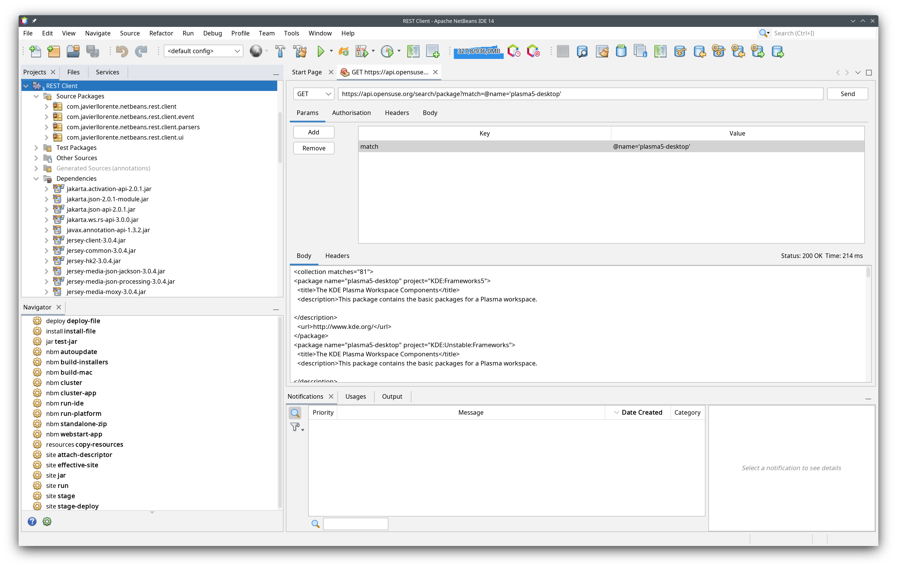

# netbeans-rest-client
A REST client for NetBeans

Features (WIP)
- Supports GET, POST and PUT request methods
- Authorisation: Basic Auth and Bearer Token
- Adding headers and body (text, JSON or XML)
- Displays response headers

Instructions
- Install the module
- Go to Tools -> REST Client

